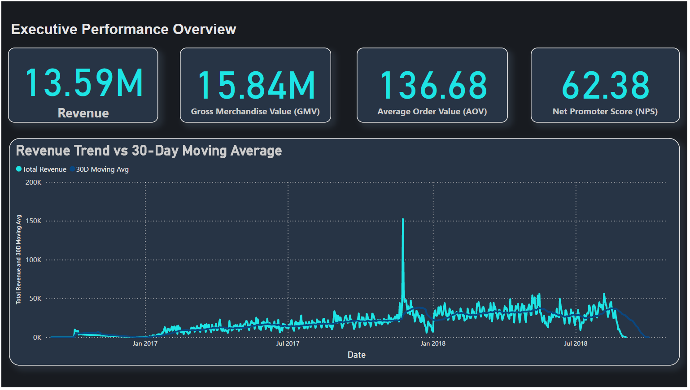
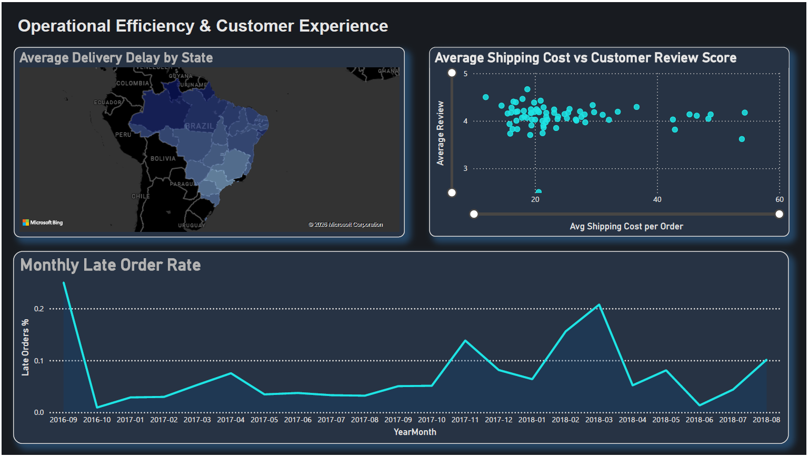
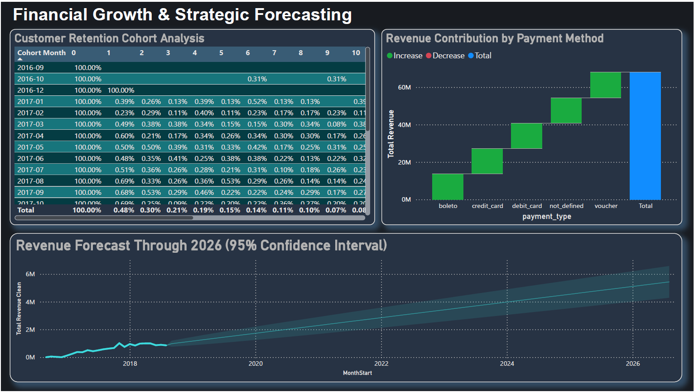

# E-Commerce Growth & Operational Strategy Analysis  
### Olist Brazil Marketplace | End-to-End SQL + Python + Power BI Project

---

## 1. Executive Overview

This project analyzes the Brazilian e-commerce marketplace **Olist** to evaluate:

- Revenue growth sustainability  
- Operational efficiency (delivery performance)  
- Customer retention and revenue concentration  
- Seller dependency risk  
- Financial forecasting through 2026  

The objective was not to generate charts, but to convert raw transactional data into executive-level strategic insights.

---

## 2. Business Problem

As Olist scaled, the company faced:

- Regional delivery delays
- Heavy dependency on a small group of customers and sellers
- Payment structure concentration risk
- Lack of forward-looking revenue planning

The challenge was transforming multi-table transactional data into decision-ready insights across finance, operations, and growth.

---

## 3. Dataset

Public Brazilian e-commerce dataset (Olist) containing:

- 100k+ orders
- Customers, sellers, products
- Payment transactions
- Reviews
- Geolocation data

Total Revenue Analyzed: **R$13.59M**  
Gross Merchandise Value: **R$15.84M**

---

## 4. Technical Architecture

**Data Pipeline**

CSV → MySQL → SQL Business Logic → Python Analysis → Power BI Dashboard

### Tools Used

- MySQL (Joins, CTEs, Window Functions, RFM logic)
- Python (Pandas, Matplotlib)
- SQLAlchemy
- Power BI
- Git & GitHub

---

## 5. Key Analyses Performed

### Business Performance
- Revenue trend with 30-day moving average
- Seasonality detection
- Month-over-Month growth (LAG window function)

### Operational Efficiency
- State-wise delivery delay analysis
- Monthly SLA breach tracking
- Shipping cost vs customer satisfaction analysis

### Customer Intelligence
- RFM Segmentation
- Cohort-style retention behavior
- Pareto analysis (Top 10% customers ≈ 47–50% revenue)

### Seller Risk Analysis
- Revenue concentration (80/20 rule)
- Top-quartile seller inactivity detection (NTILE)
- Revenue at risk identification

### Forecasting
- 3-month moving average baseline projection
- Confidence interval visualization

---

## 6. Major Insights

- Business shows stable long-term growth despite short-term volatility.
- ~38% of late deliveries are concentrated in specific regions.
- Customer retention drops sharply after first 2–3 months.
- Top 10% customers generate nearly half of total revenue.
- Revenue is heavily concentrated among a small seller group.
- Forecast indicates sustainable growth under stable conditions.

---

## 7. Strategic Recommendations

1. Focus logistics improvements on high-delay states  
2. Shift growth strategy from acquisition to retention  
3. Protect high-revenue sellers from churn  
4. Implement targeted loyalty programs for top spenders  

Estimated potential uplift: 6–8% annual revenue improvement.

---

## 8. Dashboard Preview

### Executive Performance

### Operational & Customer Experience

### Financial & Forecasting

---

## 9. How to Reproduce

1. Install MySQL
2. Run `load_data_to_mysql.py`
3. Execute SQL queries inside `/scripts/sql_queries.sql`
4. Run analysis notebook
5. Open Power BI dashboard file

---

## 10. Limitations

- Review score used as proxy for NPS
- Forecast assumes stable market conditions
- Marketing spend not available
- External macroeconomic factors excluded

---

## Final Note

This project demonstrates full-cycle analytical capability:
data extraction → transformation → business interpretation → strategic recommendation → executive visualization.